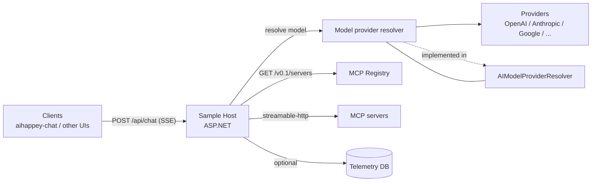

# aihappey-ai

A multi-provider **.NET 9 AI backend** that exposes:

- a **Vercel AI SDK UI message stream** compatible endpoint (`POST /api/chat`)
- **OpenAI-style** endpoints (chat completions, models, images, audio)
- hosted **Model Context Protocol (MCP)** servers (streamable-http + registry)

This repo is the “backend” counterpart of [`aihappey-chat`](https://github.com/achappey/aihappey-chat) and can also be used as a downstream AI endpoint for [`aihappey-agents`](https://github.com/achappey/aihappey-agents).

> Note: the codebase contains the foundations for **OpenAI Responses**-style request/stream models (see [`Core/AIHappey.Common/Model/Responses/ResponseRequest.cs`](Core/AIHappey.Common/Model/Responses/ResponseRequest.cs:1)), but the public HTTP surface currently focuses on **Vercel UI message streams** + **`/chat/completions`**.

## ✨ Features

- **Multi-provider routing**
  - Providers are registered via [`ServiceExtensions.AddProviders()`](Core/AIHappey.Core/AI/ServiceExtensions.cs:29)
  - Requests pick a provider by model via [`AIModelProviderResolver.Resolve()`](Core/AIHappey.Core/AI/AIModelProviderResolver.cs:137)
- **Model discovery + enrichment**
  - Providers list models; results may be enriched with Vercel AI Gateway metadata via [`AIModelProviderResolver.ResolveModels()`](Core/AIHappey.Core/AI/AIModelProviderResolver.cs:160)
- **Protocol endpoints**
  - Vercel AI SDK UI message stream: `POST /api/chat` (SSE)
  - OpenAI-style chat completions: `POST /chat/completions` (SSE or JSON)
  - Models list: `GET /v1/models`
  - Images generation: `POST /v1/images/generations`
  - Speech (text-to-speech): `POST /v1/audio/speech`
  - Transcriptions (speech-to-text): `POST /v1/audio/transcriptions`
  - MCP sampling: `POST /sampling`
- **MCP server hosting** (streamable-http)
  - Registry: `GET /v0.1/servers` via [`McpCommonExtensions.MapMcpRegistry()`](Core/AIHappey.Common/MCP/McpCommonExtensions.cs:121)
  - Server endpoints: `/{server}` via [`McpCommonExtensions.MapMcpEndpoints()`](Core/AIHappey.Common/MCP/McpCommonExtensions.cs:109)
- **Two sample hosts**
  - Header auth / local dev: [`Samples/AIHappey.HeaderAuth/Program.cs`](Samples/AIHappey.HeaderAuth/Program.cs:1)
  - Entra ID JWT auth (+ telemetry + MCP registry icons): [`Samples/AIHappey.AzureAuth/Program.cs`](Samples/AIHappey.AzureAuth/Program.cs:1)

## 🧭 Architecture



Key implementation entry points:

- Provider registration: [`ServiceExtensions.AddProviders()`](Core/AIHappey.Core/AI/ServiceExtensions.cs:29)
- Provider selection + model catalog: [`AIModelProviderResolver`](Core/AIHappey.Core/AI/AIModelProviderResolver.cs:6)
- MCP wiring (server + registry): [`McpCommonExtensions`](Core/AIHappey.Common/MCP/McpCommonExtensions.cs:12)

## 📂 Repository structure

```
.
├─ Core/
│  ├─ AIHappey.Common/          # shared request/response models + helpers
│  ├─ AIHappey.Core/            # provider implementations + resolver + MCP tools
│  └─ AIHappey.Telemetry/       # optional telemetry store + MCP telemetry tools
└─ Samples/
   ├─ AIHappey.HeaderAuth/      # sample host (no auth; provider keys via X-* headers)
   └─ AIHappey.AzureAuth/       # sample host (Entra ID JWT auth; AIServices config)
```

## 🚀 Getting Started

### Prerequisites

- **.NET 9 SDK** (pinned via [`global.json`](global.json:1))

### Build

```bash
dotnet build AIHappey.sln -c Release
```

### Run: HeaderAuth sample (simplest)

```bash
dotnet run --project Samples/AIHappey.HeaderAuth/AIHappey.HeaderAuth.csproj
```

This host is designed for local dev/trusted environments:

- no auth
- provider API keys are supplied per-request via headers (see [`HeaderApiKeyResolver`](Samples/AIHappey.HeaderAuth/HeaderApiKeyResolver.cs:5))

### Run: AzureAuth sample (JWT protected)

```bash
dotnet run --project Samples/AIHappey.AzureAuth/AIHappey.AzureAuth.csproj
```

This host enables:

- Entra ID JWT auth (`[Authorize]` on controllers)
- telemetry DB write-on-finish for chat + sampling
- extra MCP servers (telemetry) and registry icons

## ⚙️ Configuration

### HeaderAuth (keys via request headers)

No appsettings keys are required for providers. Instead send headers like:

- `X-OpenAI-Key`
- `X-Anthropic-Key`
- `X-Google-Key`
- `X-Groq-Key`
- `X-xAI-Key`
- `X-Alibaba-Key`
- `X-Baseten-Key`

The full mapping is defined in [`HeaderApiKeyResolver`](Samples/AIHappey.HeaderAuth/HeaderApiKeyResolver.cs:5).

### AzureAuth (keys via configuration)

The AzureAuth sample binds provider configuration from `AIServices` (see [`Program.cs`](Samples/AIHappey.AzureAuth/Program.cs:20) + [`AIServiceConfig`](Samples/AIHappey.AzureAuth/AIServiceConfig.cs:1)).

Minimal shape (placeholders):

```json
{
  "AzureAd": {
    "Instance": "https://login.microsoftonline.com/",
    "TenantId": "<tenant-id>",
    "ClientId": "<client-id>",
    "Audience": "<audience>"
  },
  "AIServices": {
    "OpenAI": { "ApiKey": "" },
    "Anthropic": { "ApiKey": "" },
    "Google": { "ApiKey": "" },
    "Alibaba": { "ApiKey": "" }
  },
  "TelemetryDatabase": "<connection-string>",
  "DarkIcon": "<optional-icon-url>",
  "LightIcon": "<optional-icon-url>"
}
```

Provider key resolution is implemented by [`ConfigKeyResolver.Resolve()`](Samples/AIHappey.AzureAuth/ConfigKeyResolver.cs:10).

## 🔌 HTTP API

All endpoints below are exposed by both sample hosts; AzureAuth additionally requires a valid JWT.

### Vercel Model Gateway v3 compatibility (contract-locked)

The following public endpoints are **Vercel Model Gateway v3 compatible**.

This is a **non-negotiable contract**:

- The JSON **shape** (property names, casing, nesting, and types) of the request/response DTOs is **contract-locked**.
- Do **not** rename properties, change casing, move fields, or alter types for these DTOs.
- If you need provider-specific capabilities, use the existing escape hatches:
  - request-side `providerOptions` / `providerMetadata` (opaque JSON objects)
  - response-side `providerMetadata` (opaque JSON objects)

Source of truth (DTOs):

- `/api/chat` request DTO: [`ChatRequest`](Core/AIHappey.Common/Model/ChatRequest.cs:7)
- `POST /v1/images/generations`: [`ImageRequest`](Core/AIHappey.Common/Model/ImageRequest.cs:5) / [`ImageResponse`](Core/AIHappey.Common/Model/ImageRequest.cs:49)
- `POST /v1/audio/speech`: [`SpeechRequest`](Core/AIHappey.Common/Model/SpeechRequest.cs:6) / [`SpeechResponse`](Core/AIHappey.Common/Model/SpeechRequest.cs:34)
- `POST /v1/audio/transcriptions`: [`TranscriptionRequest`](Core/AIHappey.Common/Model/TranscriptionRequest.cs:5) / [`TranscriptionResponse`](Core/AIHappey.Common/Model/TranscriptionRequest.cs:18)

#### Cross-cutting contract notes

- `model` MAY be **provider-prefixed** (e.g. `openai/gpt-4o-mini`) when sent by clients.
  - The hosts resolve the provider from the prefix and then strip it before calling the provider, e.g. [`ImageController.Post()`](Samples/AIHappey.HeaderAuth/Controllers/ImageController.cs:12), [`SpeechController.Post()`](Samples/AIHappey.HeaderAuth/Controllers/SpeechController.cs:12), [`TranscriptionsController.Post()`](Samples/AIHappey.HeaderAuth/Controllers/TranscriptionsController.cs:12).
- `providerOptions` / `providerMetadata` are **opaque JSON objects** passed through to providers.
  - Convention in this repo: the top-level keys are provider identifiers (e.g. `openai`, `google`), and each value is provider-specific JSON.
- Media payloads:
  - `audio` input (transcriptions) accepts **data-url** (`data:audio/...;base64,....`) or raw **base64**.
  - `audio` output (speech) is typically returned as a **data-url** string (provider dependent).
  - `images` output is returned as `data:image/...;base64,...` strings.

#### Compatibility checks (manual)

To verify that DTO contracts stayed intact after changes:

- Build and run [`AIHappey.HeaderAuth`](Samples/AIHappey.HeaderAuth/Program.cs:1)
- Send a minimal request matching the JSON examples below
- Ensure the server accepts the payload without model/JSON binding issues, and responses contain the expected top-level fields (`images`, `audio`, `text`, `response`, etc.)

### Vercel AI SDK (UI message stream)

`POST /api/chat`

- Content-Type: `application/json`
- Response: `text/event-stream`
- Response header: `x-vercel-ai-ui-message-stream: v1` (see [`ChatController`](Samples/AIHappey.HeaderAuth/Controllers/ChatController.cs:9))

### OpenAI-style chat completions

`POST /chat/completions`

- Accepts an OpenAI-style chat payload (see [`ChatCompletionOptions`](Core/AIHappey.Common/Model/ChatCompletions/ChatCompletionOptions.cs:1))
- If `stream: true`, responds as SSE and ends with `data: [DONE]` (see [`ChatCompletionsController`](Samples/AIHappey.HeaderAuth/Controllers/ChatCompletionsController.cs:26))

### Models

`GET /v1/models`

Returns the aggregated model list from all configured providers (see [`ModelsController`](Samples/AIHappey.HeaderAuth/Controllers/ModelsController.cs:6)).

### Images

`POST /v1/images/generations`

**Contract:** Vercel Model Gateway v3 compatible (shape is locked; see [`ImageRequest`](Core/AIHappey.Common/Model/ImageRequest.cs:5)).

Routes an image request to the provider backing the selected `model` (see [`ImageController`](Samples/AIHappey.HeaderAuth/Controllers/ImageController.cs:7)).

Minimal example:

```json
{
  "model": "openai/gpt-image-1",
  "prompt": "A cat wearing sunglasses",
  "size": "1024x1024",
  "n": 1,
  "providerOptions": {}
}
```

### Speech (text-to-speech)

`POST /v1/audio/speech`

**Contract:** Vercel Model Gateway v3 compatible (shape is locked; see [`SpeechRequest`](Core/AIHappey.Common/Model/SpeechRequest.cs:6)).

- Request model: [`SpeechRequest`](Core/AIHappey.Common/Model/SpeechRequest.cs:6)
- Response model: [`SpeechResponse`](Core/AIHappey.Common/Model/SpeechRequest.cs:34)

Example request:

```json
{
  "model": "openai/gpt-4o-mini-tts",
  "text": "Hello from AIHappey.",
  "voice": "alloy",
  "outputFormat": "mp3",
  "instructions": "Speak clearly and friendly.",
  "speed": 1.0,
  "language": "en",
  "providerOptions": {}
}
```

Notes:

- `model` uses the same provider-prefixed selector pattern as chat/images (resolved via [`AIModelProviderResolver.Resolve()`](Core/AIHappey.Core/AI/AIModelProviderResolver.cs:137)).
- `audio` in the response is typically either a data-url (`data:audio/...;base64,...`) or raw base64 (see [`SpeechTools.AI_SpeechGenerate()`](Core/AIHappey.Core/MCP/Media/SpeechTools.cs:22) for how outputs are interpreted).

### MCP Sampling

`POST /sampling`

Implements MCP “sampling” (`createMessage`) by selecting a provider based on model hints (see [`SamplingController`](Samples/AIHappey.HeaderAuth/Controllers/SamplingController.cs:7)).

### Transcriptions (speech-to-text)

`POST /v1/audio/transcriptions`

**Contract:** Vercel Model Gateway v3 compatible (shape is locked; see [`TranscriptionRequest`](Core/AIHappey.Common/Model/TranscriptionRequest.cs:5)).

- Request model: [`TranscriptionRequest`](Core/AIHappey.Common/Model/TranscriptionRequest.cs:5)
- Response model: [`TranscriptionResponse`](Core/AIHappey.Common/Model/TranscriptionRequest.cs:18)

Example request:

```json
{
  "model": "openai/whisper-1",
  "mediaType": "audio/mpeg",
  "audio": "data:audio/mpeg;base64,AAAA...",
  "providerOptions": {}
}
```

Notes:

- `mediaType` is required and must match the provided audio payload.
- `audio` is accepted as a JSON value and is expected to be a data-url or base64 (providers convert to a multipart file upload downstream; see e.g. [`OpenAIProvider.TranscriptionRequest()`](Core/AIHappey.Core/Providers/OpenAI/OpenAIProvider.Transcriptions.cs:13)).

## 🧰 MCP (Model Context Protocol)

### Registry

`GET /v0.1/servers`

Returns the MCP registry payload including streamable-http URLs (see [`McpCommonExtensions.MapMcpRegistry()`](Core/AIHappey.Common/MCP/McpCommonExtensions.cs:121)).

### Server endpoints

MCP servers are hosted at:

- `/{server}`

For example, core definitions include:

- `AI-Models`, `AI-Providers`, `AI-Images`, `AI-Speech` from [`CoreMcpDefinitions.GetDefinitions()`](Core/AIHappey.Core/MCP/CoreMcpDefinitions.cs:10)
  - Image generation tool: [`ImageTools.AI_ImageGenerate()`](Core/AIHappey.Core/MCP/Media/ImageTools.cs:22) (`ai_images_generate`)
  - Speech generation tool: [`SpeechTools.AI_SpeechGenerate()`](Core/AIHappey.Core/MCP/Media/SpeechTools.cs:22) (`ai_speech_generate`)

AzureAuth also adds telemetry MCP servers (e.g. `AI-Telemetry-Users`, `AI-Telemetry-Requests`) from [`TelemetryMcpDefinitions.GetDefinitions()`](Core/AIHappey.Telemetry/MCP/TelemetryMcpDefinitions.cs:11).

Transcriptions are currently exposed via HTTP (`POST /v1/audio/transcriptions`); there is no dedicated MCP transcription tool/server yet.

## 🔐 Security model (samples)

- **HeaderAuth**: no auth; uses per-provider header keys (see [`HeaderApiKeyResolver`](Samples/AIHappey.HeaderAuth/HeaderApiKeyResolver.cs:5))
- **AzureAuth**: Entra ID JWT auth (`AddMicrosoftIdentityWebApi`) and provider keys from configuration (see [`Program.cs`](Samples/AIHappey.AzureAuth/Program.cs:28))

## 🧪 Telemetry (optional)

The AzureAuth sample registers telemetry services via [`TelemetryServiceCollectionExtensions.AddTelemetryServices()`](Core/AIHappey.Telemetry/Extensions/TelemetryServiceCollectionExtensions.cs:13) and records request timing/token usage for:

- Vercel UI message stream chats (see [`ChatController`](Samples/AIHappey.AzureAuth/Controllers/ChatController.cs:54))
- MCP sampling (see [`SamplingController`](Samples/AIHappey.AzureAuth/Controllers/SamplingController.cs:46))

## 🧩 Provider support

Providers are implemented under [`Core/AIHappey.Core/Providers/`](Core/AIHappey.Core/Providers/:1) and surfaced through the common provider abstraction [`IModelProvider`](Core/AIHappey.Core/AI/Abstractions.cs:9).

The default sample DI registration includes (non-exhaustive): OpenAI, Anthropic, Google, Mistral, Groq, xAI, Together, Cohere, Jina, Runway, and more (see [`ServiceExtensions.AddProviders()`](Core/AIHappey.Core/AI/ServiceExtensions.cs:29)).

### asyncAI (Text-to-Speech)

- Provider id: `asyncai`
- Base URL: `https://api.async.ai/`
- Endpoint used: `POST /text_to_speech`
- Auth headers:
  - `x-api-key: <key>`
  - `version: v1`

**Models** (use provider-prefixed model ids):

- `asyncai/asyncflow_v2.0`
- `asyncai/asyncflow_multilingual_v1.0`

**Minimal request** (HTTP `POST /v1/audio/speech`):

```json
{
  "model": "asyncai/asyncflow_multilingual_v1.0",
  "text": "Hello from asyncAI.",
  "voice": "e0f39dc4-f691-4e78-bba5-5c636692cc04",
  "outputFormat": "mp3",
  "providerOptions": {
    "asyncai": {
      "output_format": { "sample_rate": 44100, "bit_rate": 192000 },
      "language": "en",
      "speed_control": 1.0,
      "stability": 50
    }
  }
}
```

Provider-specific options are deserialized to [`AsyncAISpeechProviderMetadata`](Core/AIHappey.Common/Model/Providers/AsyncAI/AsyncAISpeechProviderMetadata.cs:1).

### NVIDIA (NIM for LLMs)

- Provider id: `nvidia`
- Base URL: `https://integrate.api.nvidia.com/`
- Endpoints used:
  - `GET /v1/models`
  - `POST /v1/chat/completions` (OpenAI Chat Completions compatible)
- Auth header: `Authorization: Bearer $NVIDIA_API_KEY`

### Alibaba (DashScope) Qwen-Image (text-to-image)

Alibaba DashScope **Qwen-Image** models are supported via the Singapore (intl) synchronous API.

**Models** (use provider-prefixed model ids):

- `alibaba/qwen-image-max`
- `alibaba/qwen-image-max-2025-12-30`
- `alibaba/qwen-image-plus`
- `alibaba/qwen-image`

**Supported sizes** (provider constraint):

- `1664x928` (maps to DashScope `1664*928`, default)
- `1472x1104` (maps to `1472*1104`)
- `1328x1328` (maps to `1328*1328`)
- `1104x1472` (maps to `1104*1472`)
- `928x1664` (maps to `928*1664`)

If an unsupported size is requested, the provider falls back to `1664*928` and returns a warning.

**Provider options** (in `providerOptions["alibaba"]`) are deserialized to [`AlibabaImageProviderMetadata`](Core/AIHappey.Common/Model/Providers/Alibaba/AlibabaImageProviderMetadata.cs:3).

Common fields:

- `negativePrompt` (string)
- `promptExtend` (bool)
- `watermark` (bool)
- `size` (string, DashScope format like `1664*928`)
- `seed` (int)
- `baseUrl` (string, optional override; default is `https://dashscope-intl.aliyuncs.com`)

Notes:

- DashScope Qwen-Image returns **exactly 1** image per request (`n > 1` is treated as unsupported and produces a warning).
- The response is normalized to `data:image/png;base64,...`.

## 🧪 Status / roadmap (lightweight)

- Add a dedicated **OpenAI Responses** HTTP endpoint (`POST /v1/responses`) matching OpenAI’s streaming semantics.
- Expand MCP servers (more tools and prompts beyond model/provider discovery and telemetry).
- Add OpenAPI/Swagger descriptions for the public endpoints.

## Contributing

Issues and PRs are welcome. If you change streaming/protocol behavior, please include:

- a before/after sample payload
- an SSE transcript snippet
- notes on backward compatibility with [`aihappey-chat`](https://github.com/achappey/aihappey-chat)

